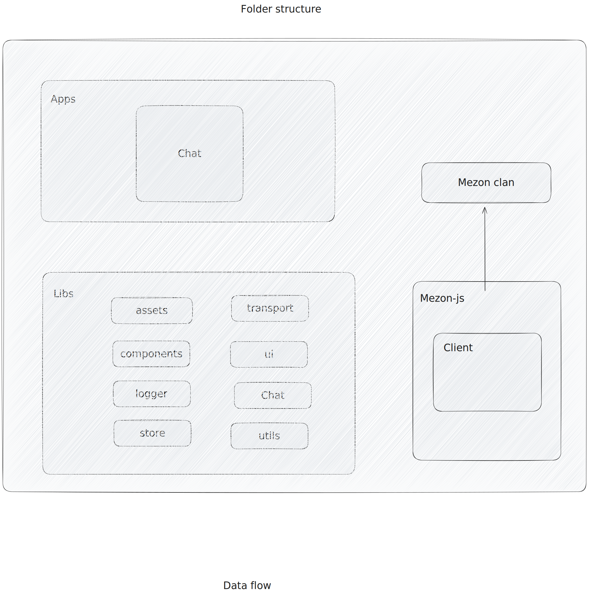
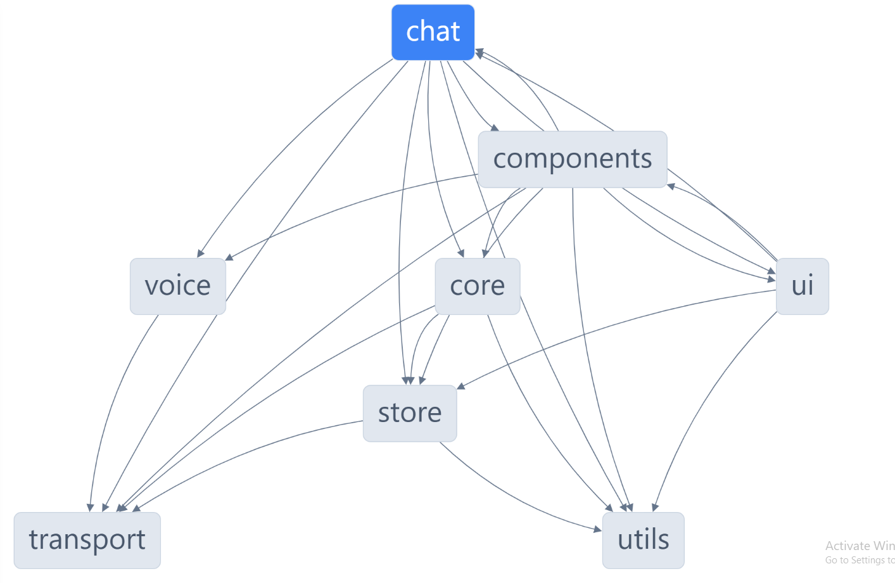
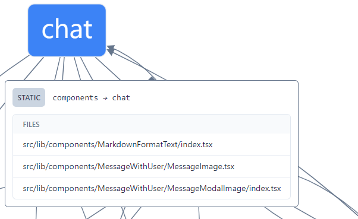
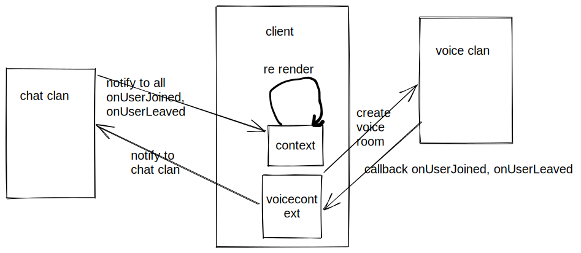
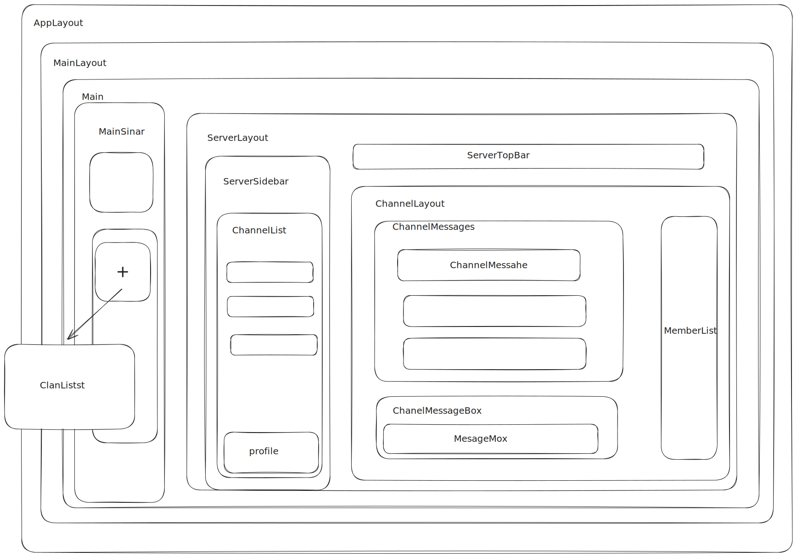

# The Live, Work, and Play Platform – the best Discord alternative.
Mezon is great for playing games and chilling with friends,
or even building a worldwide community.
Customize your own space to talk, play, and hang out.

# Bug report community
https://mezon.ai/invite/1840696977034055680

# Funny game community
https://mezon.ai/invite/1840680133686464512

# Mezon Monthly Bot Challenge
https://mezon.ai/invite/1840677412925345792

## Installing Nx Globally

`npm install --global nx@latest`

## Notes

-   using `Git Bash` to run the commands
-   using `VSCode` as the code editor

## Prerequisites

-   Node.js 18.17.0
-   yarn 1.22.17
-   git bash

## Setup

-   Clone the repository

## Install the dependencies

-   Run `yarn` to install the dependencies

## Prepare the environment variables

-   Create a `.env` file in the `apps/chat` directory

## Start the chat app

To start the development server run `yarn dev:chat`. Open your browser and navigate to http://localhost:4200/. Happy coding!

## Linting

-   Run `yarn lint` to lint the codebase
-   Run `yarn lint:fix` to fix the linting issues

## Format

-   Run `yarn format` to format the codebase
-   Run `yarn format:fix` to fix the formatting issues

## Architecture Overview

[](https://drive.google.com/file/d/1SssyfwQGJFLR80ONQ4KvV3W8qi27yt_G/preview)

## Workspace Structure



We are using monorepo architecture to manage the codebase. The workspace is divided into multiple applications and libraries. Each application is a standalone application and each library is a reusable codebase.

Workspace will be managed by [`Nx`](https://nx.dev/) which is a smart, fast and extensible build system.

### Applications

All applications are located in the `apps` directory. Each application is a standalone React application and has its own codebase.

-   `chat`: Chat application
-   `admin`: Admin application

Currently, we only focus on the `chat` application.

### Libraries

All libraries are located in the `libs` directory. Each library is a reusable codebase and can be used by multiple applications.

-   `ui`: UI elements library, the components are `stateless` and `dumb`
-   `components`: Shared components library, the components are `stateful` and `smart` perform some logic through `context` and `hooks`
-   `core`: Core library, contains the core logic of the application, could be reused by multiple applications e.g. web, mobile, desktop
-   `transports`: Transport layer library, contains the logic to communicate with the server through `mezon-js` library
-   `store`: State management library, contains the logic to manage the state of the application using `redux` and `redux-toolkit`
-   `assets`: Assets library, contains the assets used by the applications and libraries
-   `logger`: Logger library, contains the logic to log the messages
-   `utils`: Utility functions library

### Dependencies

Codebase is divided into multiple dependencies which are managed by `Nx`. There are 2 types of modules:

-   apps: standalone applications
-   libs: reusable codebase

the libraries are shared by multiple applications and could be reused by multiple applications.

There are several types of libraries:

-   `ui`: UI elements library, the components are `stateless` and `dumb`
-   `components`: Shared components library, the components are `stateful` and `smart` perform some logic through `context` and `hooks`
-   `logic`: Logic library, contains the core logic of the application, could be reused by multiple applications e.g. web, mobile, desktop
-   `utils`: Utility functions library

The dependencies are depend on each other based on the following rules `(<- = depend on)`:

-   `apps` <- `libs` ✅
-   `libs` <- `libs` ✅
-   `components` <- `ui` ✅
-   `components` <- `store` ✅
-   `store` <- `transports` ✅
-   `store` <- `utils` ✅

Bad dependencies:

-   `apps` <- `apps` ❌
-   `libs` <- `apps` ❌
-   `components` <- `apps` ❌
-   `ui` <- `components` ❌
-   `store` <- `components` ❌
-   `transports` <- `store` ❌
-   `utils` <- `store` ❌
-   `utils` <- `transports` ❌
-   `mobile libs` <- `web libs` ❌
-   `web libs` <- `desktop libs` ❌

### Dependency Graph

The dependency graph is managed by `Nx` and could be visualized by running the following command:

```bash
 npx nx graph
```

the output will be the dependency graph of the workspace.



how to read the dependency graph:

-   dependencies are represented by the arrows
-   the `apps` are the standalone applications
-   the `libs` are the reusable codebase
-   the bad dependencies are the dependencies that are not allowed, for example, `apps` <- `apps`, `libs` <- `apps`, `ui` <- `components`, etc.
-   in summary, all dependencies should be in top -> bottom direction, if a dependency is in the bottom -> top direction, it is a bad dependency
-   Cycle dependencies are not allowed, a cycle dependency is a dependency that forms a cycle, to remove the cycle dependency, we need to move the shared code to the shared library or create a new library to manage the shared code

for example, we have bad dependencies between `components` and `apps` which are not allowed.



## Data Flow

We are using `one-way` data flow architecture to manage the data flow of the application. The data flow is unidirectional follow the `Redux` pattern.


See more about the `Redux` pattern [here](https://redux.js.org/tutorials/fundamentals/part-2-concepts-data-flow).

The core concepts are `one-way` data flow and `single source of truth`.

## Application data


The application data flow is managed by some packages:

-   `mezon-js`: The core package to communicate with the server through `WebSocket` and `REST` API
    -   `WebSocket`: send and listen to the messages from the server
    -   `REST`: send and receive the messages from the server
-   `store`: The state management package to manage the state of the application. store is divided into multiple slices, each slice is a standalone slice and has its own reducer, action, and selector.

    -   `slice`: A standalone slice of the store, contains the reducer, action, and selector
    -   `reducer`: A function to manage the state of the application
    -   `action`: A function to dispatch the action to the reducer
    -   `selector`: A function to select the state from the store

-   `routing`: The routing package to manage the routing of the application. The routing is managed by `react-router-dom` package.
    -   loader: The loader to load the component dynamically
    -   route: The route to navigate to the component
    -   page: The page to render the component

### Data concept

-   When the application starts, based on the initial route, the application will load the components and pages
-   Before render components and pages, the application will trigger `loader` to load the initial data
-   The `loader` will trigger the `action` to fetch the data from the server
-   The component will render the data based on the state of the store
-   The dispatched action will trigger an `asyncThunk` to fetch the data from the server using `mezon-js` package
-   The `asyncThunk` returns the data from the server and updates the state of the store by an `extraReducers` function
-   The component or hook will select the data from the store using `useSelector`
-   the selectors will select the data from the store based on the state of the store
-   When user interacts with the component, the component will dispatch the action to update the state of the store
-   We could group the data and logic into a custom hook to manage the data and logic of the component
-   The component could use the custom hook to manage the data and logic of the component



-   in voice context, we add room voice creat function createVoiceConnection.
-   when someone join to voice room, voicecontext will send to chat server and trigger onVoiceJoined (notify all) in mezon-js.
-   we create a slice in FE to manage state when onVoiceJoined trigger and update number of joined participate in channel.

## Layouting

how to layout the components and pages



We have sevaral layout components to handle layout based on the route:

-   `/` - `AppLayout`: The layout for the application
-   `/chat` -[logged in]- `MainLayout`: The layout for the main page
-   `Main`: The main page to render the global components
-   `/chat/server/:id` - `ClanLayout`: The layout for the server page
-   `/chat/server/:id/channel/:id` - `ChannelLayout`: The layout for the channel page
-   routes are defined in the [./apps/chat/src/app/routes/index.tsx](./apps/chat/src/app/routes/index.tsx) file
-   We are using `react-router` v6 to manage the routing of the application, see more about the `react-router` v6 [here](https://reactrouter.com/en/6.22.1/start/overview)

### Access Control

Access control is managed by the `policies` slice. each user has it own permissions to access the resources. The permission is managed by the `policies` slice.

There are several ways to manage the access control:

-   using `policies` slice and `selectAllPermissionsUser` to get the permissions of the user
-   using `useSelector(selectAllPermissionsUser)` to get the permissions of the user
-   using `UserRestrictionZone` to control displaying the components based on the user permissions
-   using `useUserRestriction` to get the user restrictions based on the user permissions

### Toast Notification

Toast notification is managed by the `toasts` slice. each toast has it own message and type. The toast is managed by the `toasts` slice.

Actions

-   `addToast`: add a toast to the list
-   `removeToast`: remove a toast from the list

Toast are displayed in the `<ToastContainer />` component.

There are several ways to manage the toast notification:

-   dispatch the `addToast` action to add the toast to the list
-   dispatch any action with `withToast` meta

```tsx
    // add toast notification to any action
	return thunkAPI.fulfillWithValue(
		value,
		withToast({
			message: 'Clan changed',
			type: 'success',
		})
	);

    // dispatch the addToast action directly
    thunkAPI.dispatch(
        addToast({
            message: 'Clan changed',
            type: 'success',
        });
    );
```

### Error Handling

Error handling is managed by the `errors` slice. each error has it own message and code. The error is managed by the `errors` slice.

By default, the error is displayed as toast notification. in case you want to disable the toast notification, you could set the `toast` meta to `false`.

```tsx
// No toast notification
return thunkAPI.rejectWithValue(
	error,
	withError({
		toast: false
	})
);

// toast with custom message
return thunkAPI.rejectWithValue(error, withError('Custom error message'));

// fully custom error
return thunkAPI.rejectWithValue(
	error,
	withError({
		toast: {
			message: 'Custom error message',
			type: 'error',
			theme: 'dark'
		}
	})
);
```

## Building the application

For the `desktop` application, we are using `electron` to build the application. The application's dependencies are managed by the `apps/desktop/package.json` file. When building the application, the dependencies are installed in the `apps/desktop/node_modules` directory.

## Performance Optimization

### Performance Factors

The application performance is mostly affected by these factors:

-   The routing structure: we keep the routing straitforward and simple, make sure that one route is only re-render when the route changes
-   Unnecessary re-render: we use `memo` and `useMemo` to prevent unnecessary re-render
-   Memory leak: we use `useEffect` and `clear function` to prevent memory leak
-   Function changes reference: we use `useCallback` to prevent function changes reference
-   Api calls: we use `store` and `memoizee` to cache the api calls
-   Wrong level of abstraction: we use `custom hook` to manage the data and logic of the component, make sure that the custom hook group data of same level of abstraction, and not re-render the component when the unrelated data changes

### Performance Tools

We use several tools to measure the performance of the application:

-   `React DevTools`: to measure the performance of the application
-   `Chrome DevTools`: to measure the performance of the application

## Conventions and Guidelines

## Code Formatting

Using `Prettier` and `ESLint` to format the codebase. The codebase should be formatted before committing the code.

## Naming Convention

-   `PascalCase` for the components and pages
-   `camelCase` for the functions and variables

See more about the naming convention [here](https://github.com/airbnb/javascript/tree/master/react#naming)

## 🔔 Coding Rules

-   Stick with the architecture
-   Do not cause blocks to other team members

## ⚠ Notice

-   Identify and clarify to the team what and where you are going to add to the repo
-   Do self-test for your own codes
-   Contact **2 team members** to review your changes

## Troubleshooting

### Debug desktop app

See: https://github.com/electron/electron/issues/3331

-   1, First build and package the app as usual
-   2, Run the app with `./dist/executables/win-unpacked/mezon.exe --remote-debugging-port=8315`
-   3, Open Chrome and navigate to `chrome://inspect`
-   4, Click on `Configure...` and add `localhost:8315` to the list
-   5, Click on `inspect` to open the DevTools

## Mezon mainnet


## Screenshot


